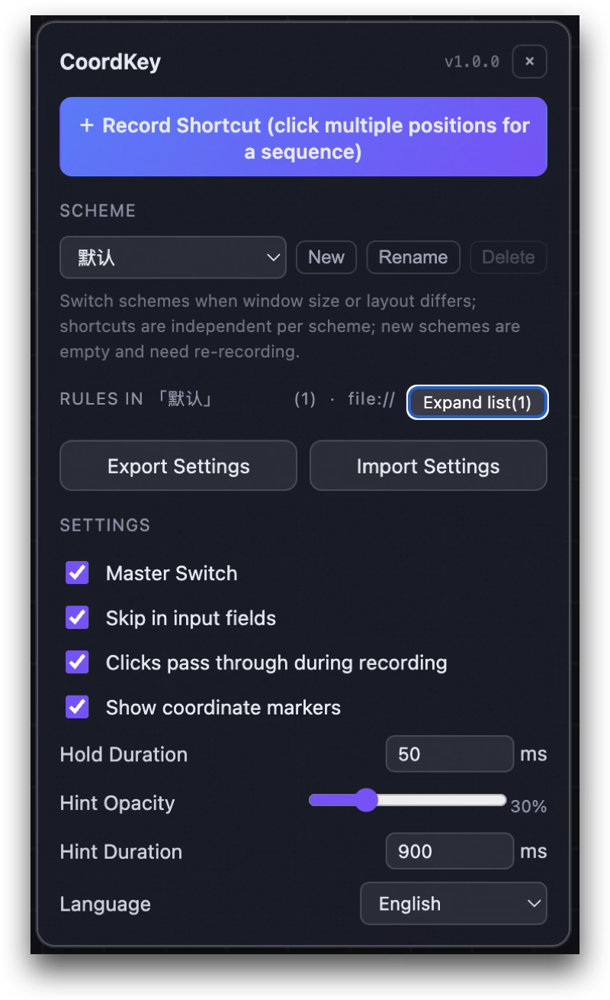
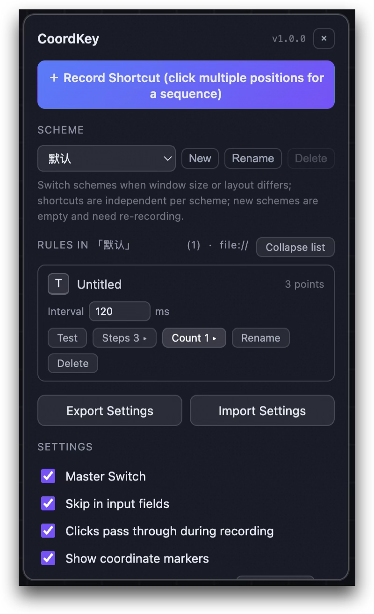
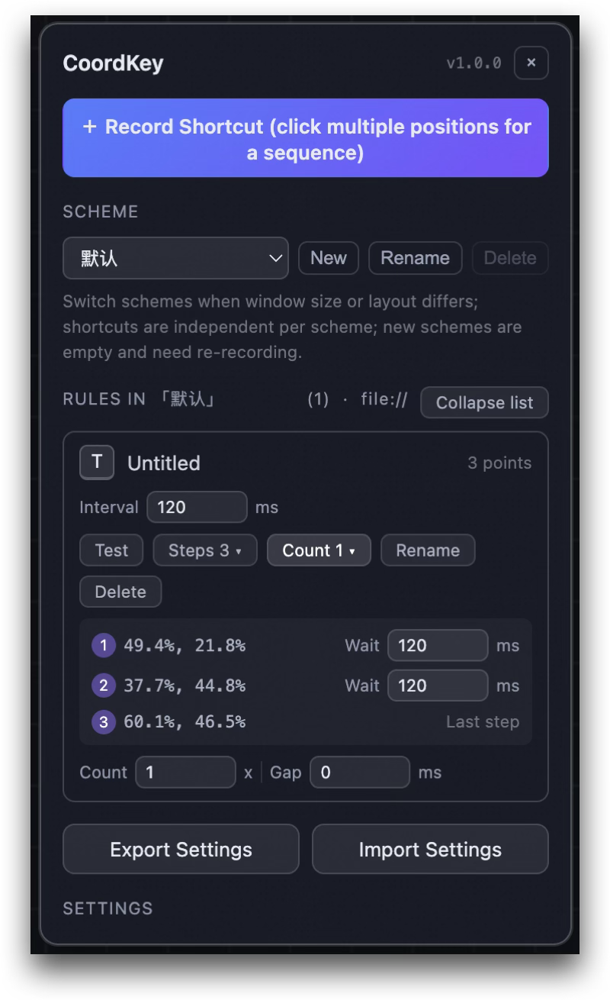

# CoordKey

> **Bind keyboard shortcuts to screen coordinates**
>
> Press a key or combo — a mouse click fires at the position you recorded.
> A productivity tool built for **Canvas apps**, **Web games**, and **repetitive UI workflows**.

[](https://github.com/oldmanpushcart/coordkey/releases)
[](LICENSE)


**[中文](README.md)** | **[English](README.en.md)**

---

## 🖼️ Preview

CoordKey provides an intuitive visual interface so you can see exactly where coordinates are recorded and how shortcuts are managed.

<table>
  <tr>
    <td align="center" style="border:none;">
      <b>1. Main Panel & Scheme Management</b><br>
      <i>Switch between layout schemes and manage shortcut lists</i>
    </td>
    <td align="center" style="border:none;">
      <b>2. Recording & Markers</b><br>
      <i>Visual crosshair with on-screen coordinate labels</i>
    </td>
    <td align="center" style="border:none;">
      <b>3. Detailed Settings</b><br>
      <i>Fine-tune click intervals and trigger behavior</i>
    </td>
  </tr>
  <tr>
    <td align="center" style="border:none;">
      
    </td>
    <td align="center" style="border:none;">
      
    </td>
    <td align="center" style="border:none;">
      
    </td>
  </tr>
</table>

---

## 💡 Why CoordKey?

There are many auto-click tools out there, but CoordKey focuses on **specific pain points**:

*   **🎨 Solve Canvas Automation**
    Traditional DOM automation cannot see inside `<canvas>` elements (Figma-like apps, web games, online whiteboards). CoordKey works via **coordinate mapping** — wherever the mouse can click, CoordKey can reproduce.
*   **⚡ Zero-build & Privacy-first**
    No Node.js, no bundler. Clone and use. Requests only the `storage` permission — no `chrome.debugger`, **no** "This browser is being debugged" banner. Ever.
*   **⌨️ Keyboard Becomes Mouse**
    Map tedious click sequences to a single key or combo (e.g. `Shift+H`). Free your right hand; make your workflow more geeky.

---

## 🚀 Core Features

### 1. Coordinate Binding & Shortcuts
*   **Single-point Trigger**: Record one coordinate, bind one key.
*   **Modifier Support**: `Ctrl` / `Shift` / `Alt` combos, with automatic reserved-key conflict detection.
*   **Visual Markers**: Non-intrusive overlay labels (e.g. `H`, `1 ⇧H`) — what you see is what you get.

### 2. Click Sequences (Macro)
*   **Multi-step Recording**: Record multiple coordinates in one go; they execute in order.
*   **Smart Intervals**: Set a global default interval, or override **per-step** (e.g. wait 2s after clicking "Save" for a page refresh, then click the next target).
*   **Repeat Execution**: Set the number of **rounds** and the interval between them for each group — ideal for loops and batch operations.
*   **Accidental-trigger Prevention**: Press the key again during playback to cancel remaining steps; auto-stops when the tab goes to background.

### 3. Multi-scheme Layouts (Responsive)
*   **Layout Isolation**: Create separate "schemes" for different layouts of the same site (e.g. 16:9 windowed vs 21:9 maximized).
*   **One-click Switch**: Swap an entire coordinate set via dropdown — no re-recording needed.

---

## 🛠️ Installation & Usage

### Installation
This project has a zero-build architecture — no dependencies to install.

1.  Clone or download this repository.
2.  Open Chrome and go to `chrome://extensions`.
3.  Enable **"Developer mode"** in the top-right corner.
4.  Click **"Load unpacked"** and select the repository root directory.

### Quick Start
1.  **Launch**: Open the target page and click the CoordKey icon in the bottom-right corner to open the panel.
2.  **Record**: Click **"＋ Record Shortcut"** -> click the target position(s) on the page (click multiple for a sequence) -> press a key to bind.
3.  **Use**: Press the bound key — a click fires at the recorded position.

---

## ⚙️ Technical Details & Limitations

For transparency and expectation management, please note:

| Feature | Notes |
| :--- | :--- |
| **Event Type** | Synthetic `MouseEvent`. Works on most pages, but banking/security pages that check `isTrusted === true` may not respond. |
| **Coordinate Calculation** | **Canvas**: Stores normalized ratios, resolution-independent.<br>**Regular pages**: Stores viewport pixels; layout reflow may cause offsets. |
| **Focus Requirement** | The page must be focused (cannot be in the address bar or DevTools). |
| **Iframe** | Not supported inside iframes; must run in the top-level page. |

---

## 📦 Versioning

**1.0.0 is CoordKey's first stable release.** Before that it was known as KeyClick during a feature-validation period. 1.0.0 also finalized the rename and storage schema.

There are **two independently versioned** numbers — check the right one when debugging:

| | Current | Source | Meaning |
| :--- | :--- | :--- | :--- |
| **App version** | `1.0.0` | `manifest.json` `version` (semver) | The extension itself. Shown as a badge next to the panel title and in exported files as `appVersion`. No other hardcoded copy exists. |
| **Config schema version** | `1` | `src/shared/protocol.js` `VERSION` (integer) | Storage format version, written inside `chrome.storage.local` data. |

They are decoupled: most features only bump the app version. Only **breaking storage changes** increment the schema version and add a migration function. Additive changes (new optional fields) never bump the schema. See [docs/storage.md](docs/storage.md) for the full strategy.

> Since 1.0.0 reset the schema counter to 1, legacy test data under the old `profile` key (v1–v3) is silently discarded and cleared. This is the only un-migrated reset.

---

## 🤝 Contributing

Issues and PRs are welcome!

*   **Zero-build Principle**: Content scripts load in the order defined by the `js` array in `manifest.json`, sharing the `self.COORDKEY` namespace. Do not introduce bundlers or dependencies.
*   **Storage Format**: Before changing the schema, read [docs/storage.md](docs/storage.md). Normalization must be **lossless** (unknown fields preserved via spread). The Service Worker may only flip `settings.enabled` — it must never write back the entire profile.
*   **Testing**: After modifying scripts, run `node tools/smoke-content.mjs` — it must output `SMOKE: PASSED`. Browser behavior cannot be automated (Chrome stable silently ignores `--load-extension`); follow [docs/manual-checklist.md](docs/manual-checklist.md) for manual acceptance.
*   **Icons**: To modify icons, run `node tools/gen-icons.mjs`.
*   **Packaging**: Run `node tools/pack.mjs` to produce `dist/coordkey-<version>.zip` — a single package shared by Chrome Web Store and Edge Add-ons. The script hand-rolls the ZIP with no dependencies or external commands; output bytes are reproducible. Store listing assets and copy are in [store/listing.md](store/listing.md).

### Directory Structure
```text
manifest.json      # MV3 manifest; content script load order is defined here
src/
├── background/    # Service Worker (master toggle & badge)
├── content/       # Page-injected core logic
│   ├── core/      # Hotkey matching, coordinate parsing, event dispatch, storage, import/export
│   └── ui/        # Panel, marker overlay, recording interaction, styles
└── shared/        # protocol.js: schema version, normalization & migrations (shared by SW and content scripts)
docs/              # Storage docs, manual checklist, screenshots
store/             # Store submission assets and listing copy (Chrome Web Store / Edge Add-ons)
test/demo.html     # Self-test page: canvas click counter, hover menu, input fields
tools/             # Smoke test, injection validation, icon generation, packaging
dist/              # Package output, gitignored
```
