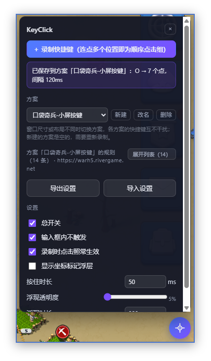
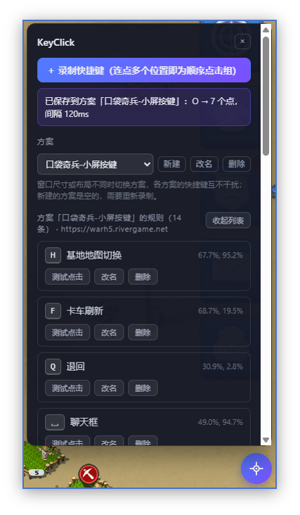
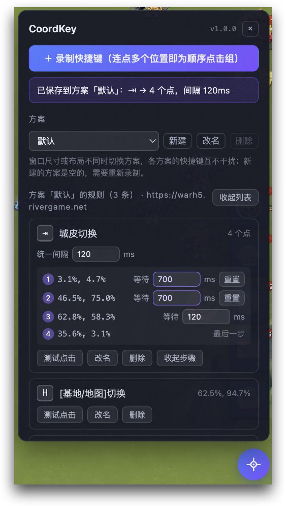

# CoordKey

> **把键盘快捷键绑定到屏幕坐标**
>
> 按下单键或组合键，就在你录下的位置触发鼠标点击。
> 专为 **Canvas 应用**、**Web 游戏** 及 **重复性 UI 操作** 设计的生产力工具。

[](https://github.com/oldmanpushcart/coordkey/releases)
[](LICENSE)


---

## 🖼️ 界面预览

CoordKey 提供直观的可视化操作界面，让你在录制坐标和管理快捷键时一目了然。

<table>
  <tr>
    <td align="center" style="border:none;">
      <b>1. 主面板与方案管理</b><br>
      <i>切换不同布局方案，管理快捷键列表</i>
    </td>
    <td align="center" style="border:none;">
      <b>2. 录制与标记</b><br>
      <i>可视化十字准星与屏幕坐标标记</i>
    </td>
    <td align="center" style="border:none;">
      <b>3. 详细设置</b><br>
      <i>微调点击间隔与触发行为</i>
    </td>
  </tr>
  <tr>
    <td align="center" style="border:none;">
      
    </td>
    <td align="center" style="border:none;">
      
    </td>
    <td align="center" style="border:none;">
      
    </td>
  </tr>
</table>

---

## 💡 为什么选择 CoordKey？

市面上有许多自动点击工具，但 CoordKey 专注于解决**特定场景下的痛点**：

*   **🎨 攻克 Canvas 自动化难题**
    传统的 DOM 自动化工具无法识别 `<canvas>` 内的元素（如 Figma 类应用、Web 游戏、在线白板）。CoordKey 基于**坐标映射**，无论 UI 是如何渲染的，只要鼠标能点，CoordKey 就能复现。
*   **⚡ 真正的“零构建”与隐私安全**
    无需 Node.js 环境，无需打包。克隆即用。仅申请 `storage` 权限，不使用 `chrome.debugger`，**绝无**“已开始调试此浏览器”的烦人提示条。
*   **⌨️ 键盘即鼠标**
    将繁琐的连点操作映射为单键或组合键（如 `Shift+H`），释放你的右手，让工作流更极客。

---

## 🚀 核心功能

### 1. 坐标绑定与快捷键
*   **单点触发**：录制一个坐标，绑定一个按键。
*   **组合键支持**：支持 `Ctrl` / `Shift` / `Alt` 等组合键，自动拦截浏览器保留键冲突。
*   **可视化标记**：在页面上生成不干扰操作的浮层标记（如 `H`, `1 ⇧H`），所见即所得。

### 2. 顺序连点组 (Macro)
*   **多步录制**：一次录制多个坐标点，按顺序自动执行。
*   **智能间隔**：支持设置全局统一间隔，也支持为每一步设置**逐步间隔**（例如：点击“保存”后等待 2秒 页面刷新，再点击下一步）。
*   **防误触机制**：播放中再次按键可取消剩余步骤；标签页切后台自动停止。

### 3. 多方案适配 (Responsive)
*   **布局隔离**：针对同一网站的不同布局（如 16:9 窗口化 vs 21:9 最大化），创建不同的“方案”。
*   **一键切换**：通过下拉框瞬间切换整套坐标映射，无需重新录制。

---

## 🛠️ 安装与使用

### 安装指南
本项目采用零构建架构，无需依赖安装。

1.  克隆或下载本仓库到本地。
2.  打开 Chrome 浏览器，访问 `chrome://extensions`。
3.  右上角开启 **“开发者模式”**。
4.  点击 **“加载已解压的扩展程序”**，选择本仓库根目录。

### 快速上手
1.  **启动**：打开目标网页，点击右下角 CoordKey 图标展开面板。
2.  **录制**：点击 **“＋ 录制快捷键”** -> 在页面点击目标位置（可连点多步） -> 按下键盘按键绑定。
3.  **使用**：按下绑定的键，即可在对应位置触发点击。

---

## ⚙️ 技术原理与限制

为了保证透明度和预期管理，请了解以下技术细节：

| 特性 | 说明 |
| :--- | :--- |
| **事件类型** | 使用合成鼠标事件 (`MouseEvent`)。大多数网页响应正常，但部分校验 `isTrusted === true` 的银行/安全页面可能无效。 |
| **坐标计算** | **Canvas**：存储归一化比例，抗缩放。<br>**普通网页**：存储视口像素，页面重排可能导致偏移。 |
| **焦点要求** | 必须在页面内（不能聚焦在地址栏或 DevTools）。 |
| **Iframe** | 不支持在 Iframe 内部使用，需在顶层页面运行。 |

---

## 📦 版本

**1.0.0 是 CoordKey 的首个正式版本。** 在此之前它以 KeyClick 为名做了一段时间的功能验证，1.0.0 同时完成了改名与存储格式定稿。

这里有两个**各自独立演进**的版本号，排查问题时请先分清是哪一个：

| | 当前值 | 来源 | 含义 |
| :--- | :--- | :--- | :--- |
| **app 版本** | `1.0.0` | `manifest.json` 的 `version`（semver） | 扩展本身的版本。界面标题右侧的徽标、导出文件里的 `appVersion` 都读它，代码里没有第二份硬编码。 |
| **配置 schema 版本** | `1` | `src/shared/protocol.js` 的 `VERSION`（整数） | 存储格式的版本，写在 `chrome.storage.local` 的数据里。 |

两者不联动：加一个功能通常只动 app 版本；只有**破坏性的存储结构改动**才会让 schema 版本 +1 并追加一个迁移函数。纯加法（新增可选字段）不升 schema 版本。完整策略见 [docs/storage.md](docs/storage.md)。

> 由于 1.0.0 把 schema 计数器归零到了 1，此前测试期写入的本地配置（旧 key `profile` 下的 v1~v3 数据）会被直接忽略并清除，需要重新录制。这是唯一一次不作迁移的归零。

---

## 🤝 贡献与开发

欢迎提交 Issue 和 PR！

*   **零构建原则**：内容脚本按 `manifest.json` 里 `js` 数组的顺序直接加载，共享 `self.COORDKEY` 命名空间。不要引入打包器或依赖。
*   **存储格式**：改动 schema 前请先读 [docs/storage.md](docs/storage.md)。归一化必须**无损**（未知字段靠 spread 保留），Service Worker 只允许翻 `settings.enabled` 一个布尔，不得把整份 profile 写回。
*   **测试**：修改脚本后，请运行 `node tools/smoke-content.mjs`，必须输出 `SMOKE: PASSED`。浏览器行为无法自动化（Chrome stable 会静默忽略 `--load-extension`），请按 [docs/manual-checklist.md](docs/manual-checklist.md) 手动验收。
*   **图标**：如需修改图标，运行 `node tools/gen-icons.mjs`。

### 目录结构
```text
manifest.json      # MV3 清单，内容脚本的加载顺序在这里定义
src/
├── background/    # Service Worker（总开关与徽标）
├── content/       # 注入页面的核心逻辑
│   ├── core/      # 快捷键匹配、坐标解析、事件派发、存储、导入导出
│   └── ui/        # 面板、标记浮层、录制交互、样式
└── shared/        # protocol.js：schema 版本、归一化与迁移，SW 与内容脚本共用
docs/              # 存储结构说明、手动验收清单、界面截图
test/demo.html     # 自测页：canvas 点击计数、hover 菜单、输入框
tools/             # 冒烟测试、注入验证、图标生成
```
